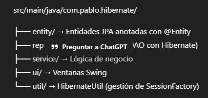

#  HibernateLOL — Sistema de Gestión con Hibernate + MySQL

Proyecto desarrollado en **Java 17** utilizando **Hibernate ORM 7**, conectado a una base de datos **MySQL** y con interfaz gráfica hecha en **Java Swing**.  
Permite gestionar jugadores, campeones, tipos, habilidades y partidas dentro de un entorno inspirado en *League of Legends*.

---

## 🎯 Objetivos de la Práctica

Este proyecto implementa los contenidos centrales de la unidad utilizando **Hibernate ORM** para el mapeo objeto-relacional sobre el esquema proporcionado por el profesor (`schema_lol`).  
A lo largo de la práctica se desarrollan los siguientes objetivos:

- Construcción de todas las **clases de entidad** (Jugador, Campeon, Tipo, Habilidad, Partida) mapeadas mediante anotaciones JPA.
- Configuración de Hibernate y **apertura de una sesión real** para comprobar la conexión con MySQL.
- Implementación de la funcionalidad para **añadir un jugador nuevo** (incluyendo el del propio alumno) desde la aplicación.
- Registro de una **partida** vinculada a un jugador existente.
- Creación desde la interfaz de un **campeón**, su **tipo asociado** y un conjunto de **habilidades** creadas por el alumno.
- Funcionalidad para **modificar el tipo de un campeón** a otro existente en la tabla `tipos`.
- Entrega del proyecto completo, configurado para funcionar con los **parámetros de conexión del equipo del profesor**.

---

## 🚀 Tecnologías Utilizadas

- **Java 17**
- **Hibernate ORM 7.1.8**
- **MySQL 8**
- **MySQL Connector/J 9.5**
- **Maven**
- **Java Swing**

---

## 🧩 Arquitectura del Proyecto

Se sigue un diseño MVC simplificado:  
**UI → Service → Repository → Hibernate → MySQL**

---

## ⚙️ Configuración de Hibernate

Archivo: `hibernate.cfg.xml`

---

## 🟢 Manejo de Errores y Mensajes Amigables

- Si la base de datos no está disponible, la aplicación no se cierra abruptamente.
- `HibernateUtil` muestra mensajes explicativos y claros para el usuario.
- Se evita `NullPointerException` en repositorios.
- Sesiones gestionadas con `try-with-resources`.

---

## ▶️ Cómo Ejecutar el Proyecto

1. Inicia MySQL y asegúrate de que el puerto sea correcto.
2. Importa el proyecto en **IntelliJ IDEA**.
3. Ejecuta la clase:
   MenuMain.java

4. Se abrirá el menú principal con las ventanas de gestión.

---

## 👤 Autor

**Pablo Carrillo**  
Estudiante de Desarrollo de Aplicaciones Multiplataforma (DAM)  
IES Rey Fernando VI – Madrid

---

## ⭐ Valor Académico

Este proyecto demuestra:

- Uso real de Hibernate y JPA
- Mapeo objeto-relacional con entidades bien definidas
- Arquitectura en capas
- Conexión estable a MySQL
- Gestión visual de datos mediante Swing

Ideal tanto para evaluación académica como para integrarlo en un portfolio profesional.

